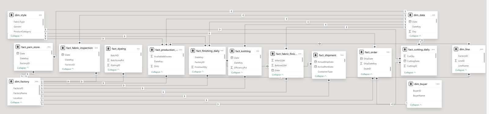
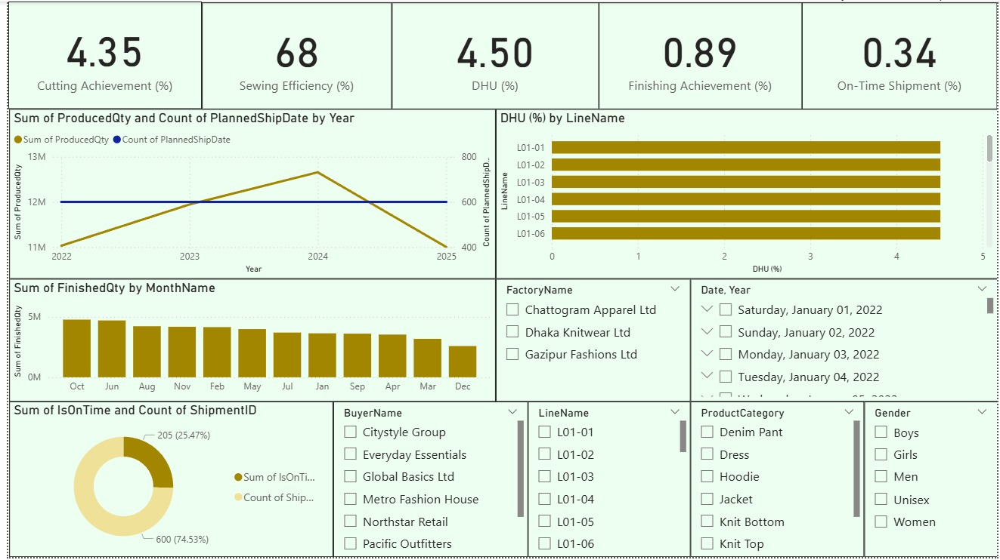
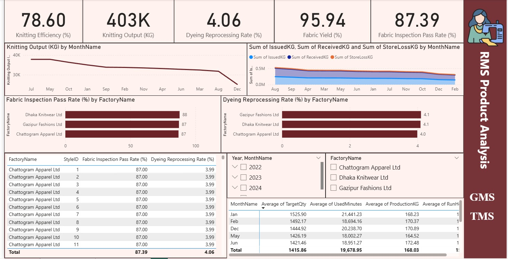

# RMG Production Analysis

A comprehensive Data Analysis project focused on the Ready-Made Garments (RMG) sector. This project provides deep insights into the production lifecycle, split across two major manufacturing phases: the **Textile Manufacturing System (TMS)** and the **Garments Manufacturing System (GMS)**. 

By utilizing interactive dashboards and a robust data model, this project helps track efficiency, output, and quality control metrics across various factories and production lines.

## 📊 Data Model

The project is built on a comprehensive relational data model (Star/Snowflake Schema) designed to handle complex manufacturing data. 

* **Fact Tables:** Tracks daily metrics across different stages including Yarn Store, Knitting, Fabric Inspection, Dyeing, Cutting, Production (Sewing), Finishing, Orders, and Shipments.
* **Dimension Tables:** Provides filtering and contextual details such as Style, Factory, Date, Line, and Buyer.

---

## 📈 Dashboards & Insights

The analysis is divided into two primary dashboards to reflect the different stages of garment production.

### 1. Garments Manufacturing System (GMS) Dashboard
The GMS dashboard focuses on the cut-make-trim (CMT) and finishing phases of the apparel manufacturing process.

**Key Metrics Tracked:**
* Cutting Achievement (%)
* Sewing Efficiency (%)
* Defects per Hundred Units (DHU %)
* Finishing Achievement (%)
* On-Time Shipment (%)

**Highlights:**
* Year-over-year production vs. planned shipment tracking.
* Detailed DHU analysis by individual production lines.
* Interactive filters for Factory, Buyer, Product Category, and Gender.

### 2. Textile Manufacturing System (TMS) Dashboard
The TMS dashboard monitors the fabric creation and preparation stages, ensuring the raw materials meet quality standards before entering the GMS phase.

**Key Metrics Tracked:**
* Knitting Efficiency (%) & Knitting Output (KG)
* Dyeing Reprocessing Rate (%)
* Fabric Yield (%)
* Fabric Inspection Pass Rate (%)

**Highlights:**
* Trend analysis for knitting output over time.
* Material tracking showing Issued vs. Received vs. Store Loss KG.
* Quality control benchmarking (Inspection Pass Rate & Dyeing Reprocessing Rate) compared across different factory locations.

---

## 🛠️ Tools Used
* **Data Visualization & Modeling:** Power BI
* **Data Processing:** DAX (Data Analysis Expressions) & Power Query

## 🚀 How to Use
1. Clone the repository: `git clone https://github.com/sumaiyasiddique40/RMG-Production-Analysis.git`
2. Open the `.pbix` file using Microsoft Power BI Desktop.
3. Use the slicers on the right and bottom panels of the dashboards to filter the data by Factory, Date, Buyer, or Line to explore specific insights.
